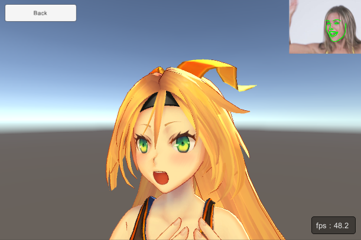
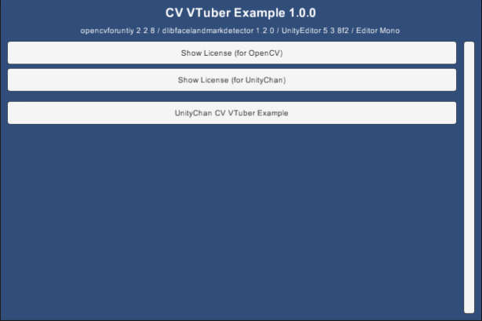

CV VTuber Example
====================

Overview
-----
<https://www.assetstore.unity3d.com/#!/content/118186>

ScreenShot
-----
 
 
 

Demo
-----
- WebGL
<https://enoxsoftware.github.io/CVVTuberExample/webgl_example/index.html>
- Android
<https://play.google.com/store/apps/details?id=com.enoxsoftware.cvvtuberexample>

Manual
-----
[ReadMe.pdf](/Assets/CVVTuberExample/ReadMe.pdf)

